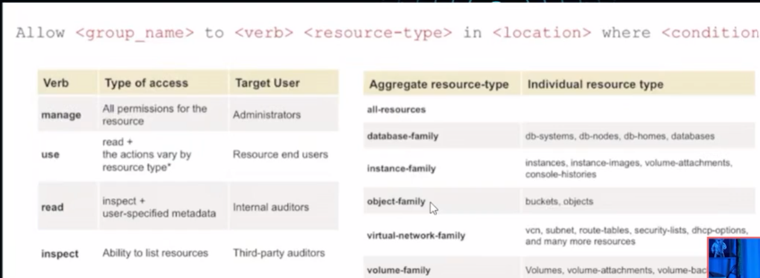

# iam-identity and access management

# COMPONENTES PRINCIPALES
COMPARTIMIENTOS (COMPARTMENTS)
USUARIOS (USERS)
GRUPOS (GROUPS)
POLITICAS (POLICIES)
DOMINIO (TENANCY)
LLAVE DE ACCESO - TOKENS

## PUNTO CLAVE: TENANCY ES LA CUENTA PRICIPAL

FEDERATION
PRINCIPALS

# RESOURCES CLOUD OBJECTS

BLOCK STORE
OBJECT STORE
FILE STORAGE
STORAGE GATEWAY
BUCKETS
AUTONOMOUS DATABASE
DATABASE SYSTEM
VIRTUAL MACHINE
VIRTUAL CLOUD NETWORK
LOAD BALANCER
CONTAINERS
CONTAINER ENGINE FOR KUBERNETES
SERVICE GATEWAY
INTERNET GATEWAY
AUTOSCALING
INSTANCE POOLS
DYNAMIC ROUTING GATEWAY
ROUTE TABLE
FUNTIONS
CONTAINER REGISTER
SECURITY LIST

# COMPARTMENT - COMPARTIMIENTO
COLECCION DE RECURSO RELACIONADOS
ISOLADOS CON CONTROL DE ACCESO
EL COMPRTAMIENTO ROOT "PRINCIPAL" PUEDE MANEJAR TODOS LOS RECURSOS DE OCI
SE PUEDEN ANIDAR HASTA 6 NIVELES DE COMPARTIMENTOS
RECOMENDACION: CRE COMPARTIMENTOS DEDICADOS PARA ISOLAR RECURSOS

TENANCY/ ROOT COMPARTMENT
COMPARTMENT NETWORK: VITUAL CLOUD NETWORK

# IDENTITY DOMAINS - DOMINIOS DE IDENTIDAD
CONTENEDOR PARA USUARIOS Y GRUPOS, REPRESENTA USUARIOS EN OCI ASI COMO SUS CONFIGURACIONES Y AJUSTES DE SEGURIDAD ASOCIADOS

# ORACLE CLOUD ID - OCID 
OCID1 -VERSION OCID
REAL - CONFIGURACION DE REGIONES QUE COMPARTE LA MISMA CARACTERISTICAS COMERCIAL/GOBIERNO
RESOURCE TYPY: TIPO DE RECURSO (INSTANCIA, VOLUMEN, VCN, SUBNET, USER, GROUP)
UNIQUE ID: ID UNICO CREADO PARA EL RECURSO

# POLICIES - POLITICAS
POLITICAS - DEFINICIONES EN FORMATO ENTENDIBLE PARA DEFINIR LOS PERMISOS GRANULARES

ALLOW GROUP <GROUP_NAME> TO <VERB> <RESOURCE-TYPE> IN TENANCY

ALLOW <GROUP_NAME> TO <VERB> <RESOURCE-TYPE> IN <LOCATION> WHERE <CONDITIONS>

ALL-RESOURCES, DATABASE-FAMILY, INSTANCE-FAMILY, OBJECT-FAMILY, VIRTUAL-NETWORK-FAMILY, VOLUME-FAMILY

# AUTHN AND AUTHZ

AUTHN -AUTENTICACION= QUIEN ERES?

AUTHZ - AUTORIZACION= QUE PUEDES HACER?

# CONFIGURACION TENANCY - CUENTA 
NO UTILIZAR LA CUENTA DE ADMINISTRACION DE TENANCY PARA LAS OPERACIONES DEL DIAS A DIA
CREAR COMPARTIMIENTOS DEDICADOS PARA ISOLAR RECURSOS 
UTULIZAR MULTIFACTOR AUTHENTICATION MFA

CREAR DOS CUENTAS PERO QUE NO SEA ROOT

TENANCY ADMIN - OCI ADMIN - OCI ADMIN GROUP - POLICIES

# OCI IAM

## ¿Qué componente de IAM - Gestión de Identidad y Acceso ayuda a organizar a varios usuarios en un equipo?

Grupos

Los grupos en OCI Identity and Access Management (IAM) se utilizan para organizar varios usuarios en un equipo, facilitando la gestión de permisos y accesos.

## ¿Cuál afirmación sobre OCI Identity and Access Management es verdadera?

Permite controlar el acceso para un grupo de usuarios

OCI Identity and Access Management (IAM) permite controlar el acceso para un grupo de usuarios, facilitando la gestión de permisos y accesos a los recursos en la nube.

## ¿Qué afirmación sobre los compartimientos de la OCI NO es cierta?

Es una práctica recomendada crear todos tus recursos en el compartimento raíz - root

No es una práctica recomendada crear todos los recursos en el compartimento raíz. Los compartimentos se utilizan para organizar y aislar recursos, proporcionando un nivel más refinado de control de acceso.

## ¿Cuál NO es un componente de OCI Identity and Access Management?

Grupo de Seguridad de Red

El grupo de seguridad de red es un componente de OCI Networking, no de IAM. El IAM en la OCI consiste en Principales, Políticas, Federación y algunos otros componentes.

## ¿Cómo se identifica un recurso en OCI?

Con OCID

Cada recurso en OCI está identificado por un Oracle Cloud Identifier (OCID) único, que se utiliza para identificar el recurso.