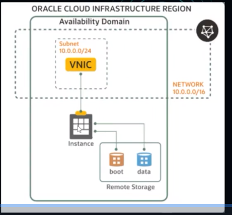
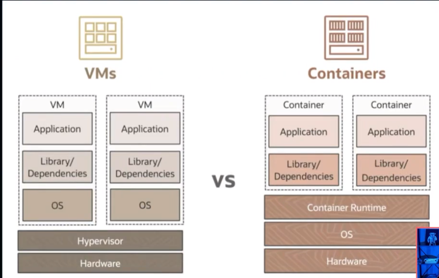
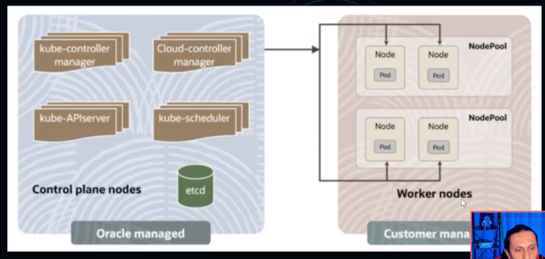
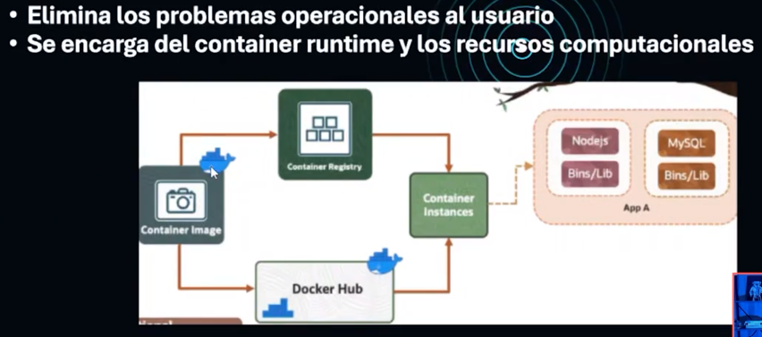
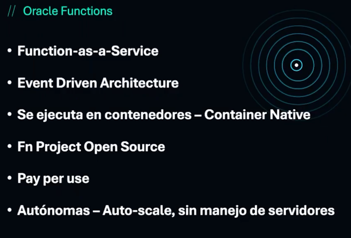

# TIPOS DE MAQUINA EN ORACLE CLOUD

VIRTUAL MACHINE

BARE METAL

DEDICATED HOST

# CARACTERISTICAS

CPU
MEMORIA

# SIZING

SMALL
MEDIUM
LARGUE

# INSTANCE - INSTANCIA
- TIPOS DE PROCESADOR
AMPARE
AMD
INTEL

- MODELOS DE PAGO
PAY AS YOU GO -PAYG
PAGA POR LO QUE USAS

VNIC= VIRTUAL NETWORK INTERFACE CAP

# HORIZONTAL SCALING

AGREGAR MAS INSTANCIAS DEL MISMO TIPO
SI UNA VM FALLA, LAS DEMAS SIGUEN FUNCIONANDO
MANEJO DEPENDIENDO DE LA DEMANDA DE TRAFICO
NO HAY COSTO EXTRA POR USAR AUTOSCALING

# VERTICAL SCALING

HAY UNA VENTAJA DE CAIDA
MODIFICA LA FORMA DE LA INSTANCIA HACIA ARRIBA O ABAJO

# ORACLE CONTAINER ENGINE FOR KUNERNETES -OKE

# ORQUESTACION DE CONTENEDORES

DEPLOY - DESPLEGAR
MANAGE - MANEJO
CONNECT - CONEXION
SCALE UP/DOWN - ESCALAMIENTO

# K8S - KUBERNETES

AUTOMATIZAR
DESPLEGAR
ESCALAR
ADMINISTRAR APPS CONTENERIZADAS

# TIPOS DE CLUSTERS OKE

ENHANCED CLUSTER -MEJORADOS
BASIC CLUSTER - BASICO

# MANEJO MANGED NODES

TU ERES RESPONSABLE POR EL ,AMEJO DE LOS NODOS, PUEDES MADIFICARLOS A TUS NECESIDADES
TIENES LA RESPONSABILIDAD DE ACTUALIZAR K8S Y SUS RESPECTIVOS PARCHES DE SEGURIDAD
SE PUEDEN CREAR TANTO EN CLUSTER BASICO Y MEJORADOS

# MANEJO VIRTUAL NODES

LOS NODOS VIRTUALES PROPORCIONAN UNA EXPERIENCIA DE K8S 'SERVERLESS', POSIBILITANDO EJECUTAR APLICACIONES CONTENERIZADAS A ESCALA
K8S ES ACTUALIZADO U PARCHES DE SEGURIDAD SON APLICADOS
SOLO SE PUEDEN CREAR NODOS VIRTUALES Y CONJUNTOS DE NODOS VIRTUALES EN ENHANCED CLUSTER

# OCI CONTAINER INSTANCE

ELIMINA LOS PROBLEMAS OPERACIONALES AL USUARIO
SE ENCARGA DE CONTAINER RUNTIME Y LOS RECURSOS COMPUTACIONALES

# ORACLE FUNCTIONS

Imagina que Oracle Cloud Infrastructure (OCI) es como un edificio de apartamentos donde puedes alquilar diferentes tipos de espacios según tus necesidades:

    Bare Metal: Es como alquilar un terreno baldío. Tienes total libertad para construir lo que quieras, desde los cimientos hasta el techo. Tú decides qué materiales usar, cómo diseñar la estructura y cómo mantenerla. Es ideal si necesitas un control absoluto sobre todo, pero también implica más responsabilidad.
    Máquinas Virtuales: Es como alquilar un apartamento en el edificio. Ya tienes una estructura básica (paredes, techo, etc.) y puedes personalizar el interior a tu gusto. No tienes que preocuparte por el mantenimiento del edificio en sí, solo por tu propio espacio. Es una buena opción si necesitas flexibilidad pero no quieres encargarte de la infraestructura subyacente.
    Contenedores: Imagina que son como cajas modulares que puedes apilar y mover fácilmente. Cada caja contiene todo lo necesario para ejecutar una aplicación específica. Puedes tener varias cajas (contenedores) en un mismo apartamento (máquina virtual) y moverlas a otro apartamento si es necesario. Esto facilita la gestión y el despliegue de aplicaciones.
    Funciones (Oracle Functions): Son como contratar a un servicio de limpieza que solo viene cuando lo necesitas. En lugar de alquilar un espacio completo (como en las opciones anteriores), solo pagas por el tiempo que el servicio está activo. Por ejemplo, podrías tener una función que se active automáticamente cada vez que alguien sube una foto a tu sitio web para redimensionarla y optimizarla. Solo pagas por el tiempo que la función está procesando la imagen.

En resumen:

    Bare Metal: Control total, pero más responsabilidad.
    Máquinas Virtuales: Flexibilidad y menos preocupaciones sobre la infraestructura.
    Contenedores: Facilidad para gestionar y desplegar aplicaciones.
    Funciones: Ahorro de costos y escalabilidad automática.

# ¿Cuál es el propósito principal de Oracle Cloud Infrastructure Functions? 

Ejecutar código en respuesta a eventos o solicitudes HTTP

El propósito principal de OCI Functions es ejecutar código en respuesta a eventos o solicitudes HTTP, proporcionando una plataforma de computación sin servidor que permite a los desarrolladores construir, implementar y ejecutar aplicaciones sin necesidad de gestionar la infraestructura subyacente. 

# ¿Qué dos parámetros se pueden personalizar al crear una instancia de cómputo flexible? 

Cantidad de memoria

Al crear una instancia de cómputo flexible en OCI, los usuarios pueden personalizar el número de Oracle Cloud Processor Units (OCPUs) y la cantidad de memoria asignada a la instancia. El número de NICs virtuales y físicas no son parámetros personalizables para instancias flexibles.
Alternativa correta

Número de OCPUs

Al crear una instancia de cómputo flexible en OCI, los usuarios pueden personalizar el número de Oracle Cloud Processor Units (OCPUs) y la cantidad de memoria asignada a la instancia.

# ¿Qué afirmación sobre el funcionamiento del escalado automático en un pool de instancias es verdadera? 
Provisiona y elimina automáticamente instancias en un pool de instancias

El escalado automático en un pool de instancias en el servicio OCI Compute provisiona y elimina automáticamente instancias según condiciones o programaciones específicas. No cambia la forma de la instancia de cómputo y puede basarse en políticas impulsadas por métricas y programación. 

# ¿Qué tipo de almacenamiento está asociado a las instancias en el servicio OCI Compute? 

Almacenamiento en Bloque - Block

El almacenamiento en bloque es el tipo de almacenamiento asociado a las instancias en el servicio OCI Compute. Proporciona volúmenes de almacenamiento de alto rendimiento y baja latencia que pueden adjuntarse a las instancias para almacenar datos y aplicaciones. 

# ¿Qué tipo de procesador NO está disponible para el servicio OCI Compute? 
Snapdragon

El servicio OCI Compute ofrece instancias con varios tipos de procesadores, incluidos AMD, Intel y Ampere. Sin embargo, el Snapdragon, que es un tipo de procesador comúnmente utilizado en dispositivos móviles, no está disponible en OCI Compute. 