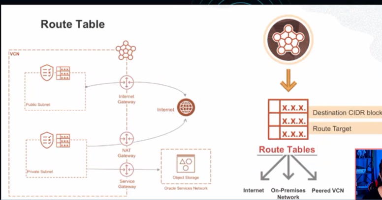
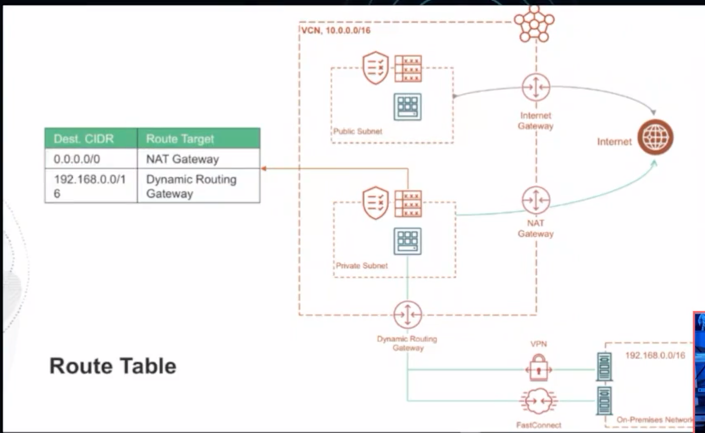
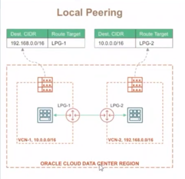
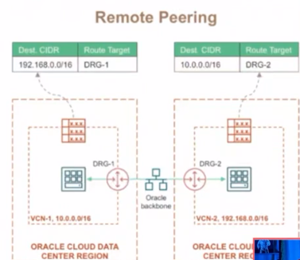
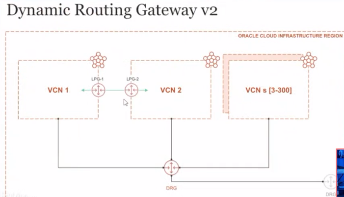
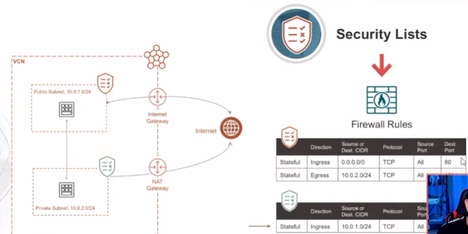
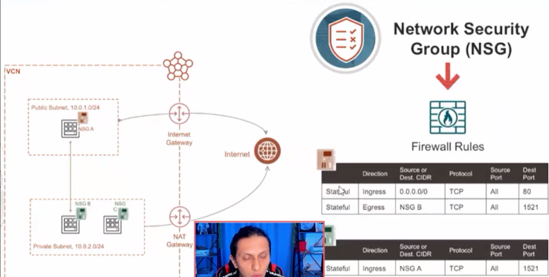
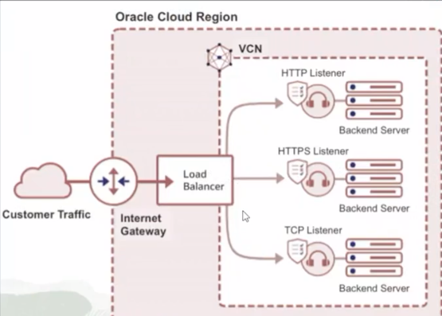
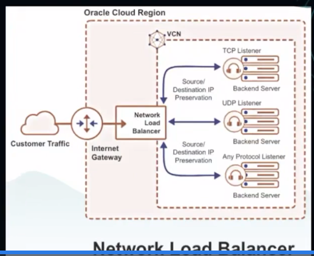

# NETWORKING

VCN- VIRTUAL CLOUD NETWOTK

VCN: PUBLIC SUBNET(10.0.1.0/24)/ PRIVATE SUBNET(10.0.2.0/24)

SERVICIOS POR REGION
PROVEE ALTA DISPONIBILIDAD
COMUNICACION SEGURA

CIDR-CLASSLESS INTER-DOMAIN ROUTING ENRUTAMIENTO ENTRE DOMINIOS SIN CALSE

VCN - 10.0.0.0/16
PUBLIC SUBNET - 10.0.1.0/24
PRIVATE SUBNET - 10.0.2.0/24
.. SUBNET - 10.0.X.X/24

VCN - VIRTUAL NETWORK
                                                                            -> INBOUND
VCN - 10.0.0.0/16 -> PUBLIC SUBNET- 10.0.1.0/24 -> INTERNET GATEWAY -> INTERNET -> NAT GATEWAY -> PRIVATED SUBNET 10.0.2.0/24 -> SERVICE GATEWAY -> OBJECT STORAGE(ORACLE SERVICE NETWORK)
                                                                            OUTBOUND <-               
                                                                                                       -> DYNAMIC ROUTING GATEWAY -> VPN/ FASTCONNECT -> ON-PREMISES NETWORK

INTERNET GATEWAY/ NATGATEWAY/ SERVICE GATEWAY

# COMMUNICATION--------------------ON-PREMISES

DYNAMIC ROUTING GATEWAY/ SITE-TO-SITE VPN CONNECT/ FASTCONNECT

INTERNET GATEWAY - COMUNICACION BIDIRECCIONAL ENTRE LA VCN E INTERNET
SERVICE GATEWAY - ACCESO DESDE LA VCN PARA SERVICION PUBLICOS DE ORACLE
NAT GATEWAY - COMUNICACION DE UNA SOLA DIRECCION ENTRE LA VCN E INTERNET
DYNAMIC ROUTING GATEWAY - ACCESO DESDE LA VCN A OTROS DESTINOS ADEMAS DE INTERNET

# VCN WIZARD
## START VCN WIZARD

# ROUTE TABLES

## LOCAL PEERING
DEST. CIDR / ROUTE TARGET

## REMOTE PEERING
DEST. CIDR / ROUTE TARGET

## DYNAMIC ROUTONG GATEWAY V2

# SECURITY LIST NSG(NETWORK SECURITY GROUP)

REGLAS DE INGRESO Y EGRESO QUE ESPECIFICAN EL TIPO DE TRAFICO PERMITIDO IN/OUT
SECURITY LIST: LISTA DE REGLAS QUE APLICAN PARA TODOS LOS RECURSOS EN UNA SUBNET
NSG: LISTA DE REGLAS QUE APILICA A CUALQUIER RECURSO EN LA VCN QUE ESPECIFIQUEMOS (VNICS - VISTUAL NETWORK INTERFACE CARDS)

## NETWORK SECURITY GROUP

# LOAD BALANCER

OSI LAYER 7- HTTP/HTTPS
PUBLICO Y PRIVADO
ESCALBLE - FLEXIBLE(10MBPS-8GBPS)
DINAMICO (MICRO, SMALL, MEDUIM, LARGE)

# NETWORK LOAD BALANCER

OSI LAYER 4 & 3 - TCP,UPDP ICMP
PUBLICO Y PRIVADO

# CREANDO UN LB

## ¿Cuál afirmación sobre la conexión(peering) de Virtual Cloud Network (VCN) entre dos VCNs NO es válida?
Una conexión (peering) de VCN es una conexión basada en VPN

El emparejamiento de VCN no está basado en VPN; es una conexión de red entre dos VCNs que permite el enrutamiento de tráfico entre ellos utilizando direcciones IP privadas.

## ¿Cuál afirmación sobre una Virtual Cloud Network (VCN) es verdadera? 
Una VCN puede residir solo en una única región, pero puede abarcar varios dominios de disponibilidad

## ¿Qué componente NO se crea por defecto al crear una Red de Nube Virtual? 
Gateway de Emparejamiento Local Predeterminado - Local Peering

Cuando se crea una VCN, se generan automáticamente una tabla de ruta predeterminada, una lista de seguridad predeterminada y opciones de DHCP, pero un Gateway de Emparejamiento Local (LPG) no se crea por defecto. Como parte de la configuración de VCN, cada administrador debe crear un LPG para su respectivo VCN. 

## ¿Qué tráfico de capa OSI es compatible con el Balanceador de Carga de Red - Network Load Balancer de OCI? 
Capa 4 (transporte)

El Balanceador de Carga de Red de OCI opera en la capa 4 del modelo OSI, que es la capa de transporte. 

## ¿Qué componente de la VCN bloquea el tráfico de entrada pero permite el tráfico de salida a Internet? 
NAT Gateway

Un Gateway NAT en una VCN permite que las instancias en una subred privada inicien conexiones con Internet, pero impide conexiones de entrada no solicitadas desde Internet. 

