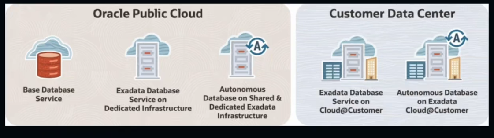
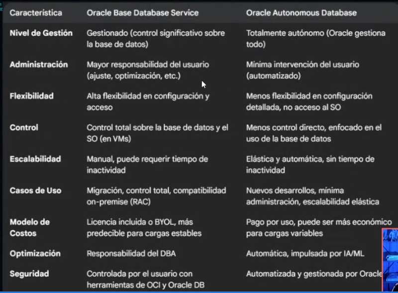
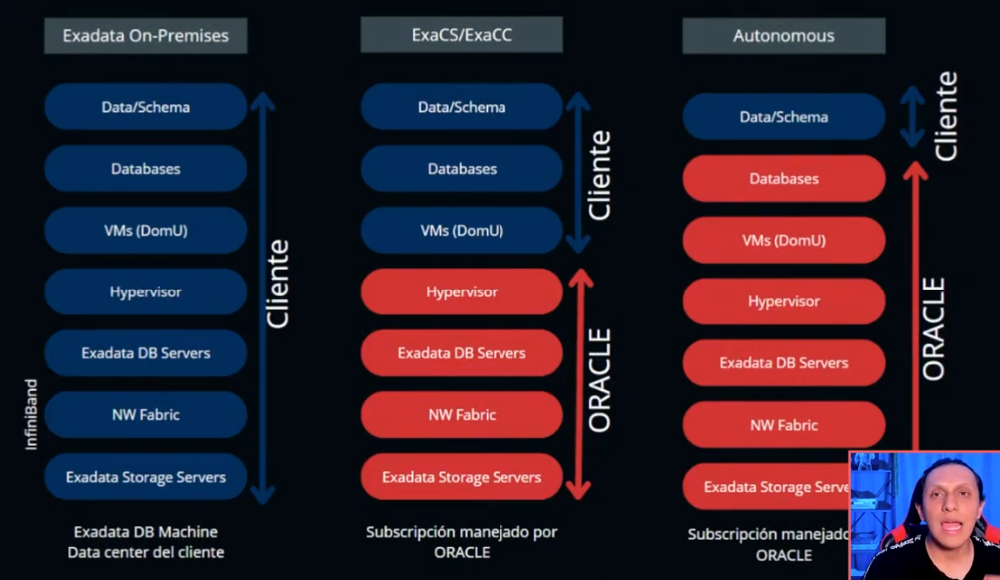
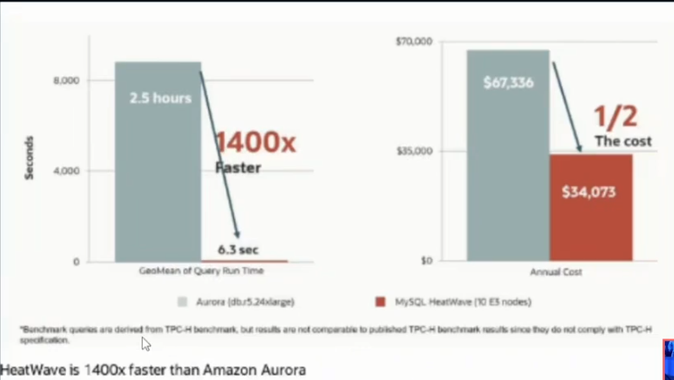
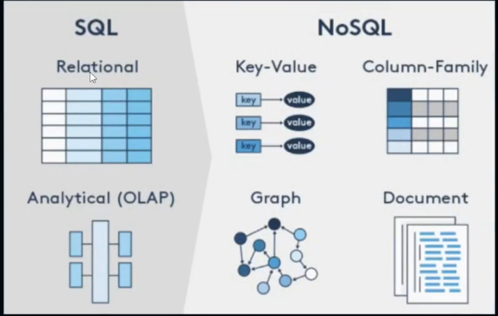
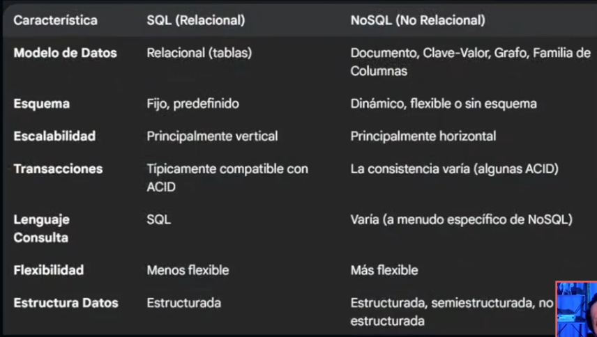

# OCI DATABASE SERVICE

## PRINCIPALES SERVICIOS
ORACLE AUTOMOUS DATABASE
ORACLE EXADATA CLOUD SERVICE
MYSQL HEATWAVE
BARE METAL, VM DB SYSTEMS Y NO SQL DATABASE

# PROBLEMAS
DIFICUALTAD EN LA ADMINISTRACION Y OPTIMIZACION
BAJO DESEMPEÑO Y LATENCIA ALTA
ESCALABILIDAD LIMITADA
FALTA DE AUTOMATIZACION Y SEGURIDAD

EXACS -EXADATACLOUD SERVICE

# MEJOR OPCION
ANALIZAR LAS NECESIDADES
SELECCIONAMOS LA MEJOR OPCION

# ORACLE BASE DATABASE SERVICE

## ORACLE BASE DATABASE SERVICE
ES UN SERVICIO DE BASE DE DATOS TOTALMENTE GESTIONADO QUE TE PERMITE EJECUTAR EN VM BASES DE DATOS
ORACLE ENTERPRISE EDITION Y STANDART EDITION EN LA INFRAESTRUCTURA DE ORACLE CLOUD INFRASTRUCTURE (OCI)

TE OFRECE UNA FORMA SENCILLA, FLEXIBLE, SEGURA Y RENTABLE DE EJECUTAR TUS BASES DE DATOS ORACLE EN LA NUBE, APROVECHANDO 
LA POTENCIA DE ORACLE DATABASE Y LA INFRAESTRUCUTRA DE OCI SIN LA COMPLEJIDAD DE LA ADMINISTRACION MANUAL

# EDICIONES
STANDART EDITION
ENTERPRISE EDITION
ENTERPRISE EDITION HIGH PERFORMANCE
ENTERPRISE EDITION EXTREME PERFORMANCE

# CARACTERISTICAS

CONTROL TOTAL: AUNQUE ES UN SERVICIO GESTIONADO, TE DA CONTROL TOTAL SOBRE TUS DATOS Y LA CONFIGURAION DE LA BASE DE DATOS.
TIENES ACCESO DE ADMINISTRADOR Y PUEDES DEFINIR POLITOCAS DE SEGURIDAD.

FLEXIBILIDAD: PUEDES ELEGIR ENTRE DIFERENTES FORMAS DE MAQUINAS VIRTUALES(VM) CON DISTINTAS CANTIDADES DE CPU, MEMORIA Y ALMACENAMIENTO PARA ADAPTARSE A TUS NECESIDADES DE RENDIMIENTO Y COSTOS. TAMBIEN PUEDES ESCALAR ESTOS RECURSOS SEGUN SEA NECESARIO.

AUTOMATIZACION: ORACLE SE ENCARGA DE TAREAS COMUNES DE ADMINISTARCION COMO PARCHES, COPIAS DE SEGURIDAD, RECUPERACION Y LA CONFIGURACION DE ORACLE DATA GUARD PARA LA PROTECCION CONTRA DESASTRES.
ESTO REDUCE LA CARGA OPERATIVA DE TU EQUIPO DE TI.

OPCIONES DE LICENCIAMIENTO: PUEDES OPTAR POR UNA OPCION DE PRECIOS QUE INCLUYE EL SOFTWARE DE ORACLE O UTILIZAR TUS PROPIAS LICENCIAS (BYOL - BRING YOUR OWN LICENSE).

# ORACLE AUTONOMOUS DATABASE

ES UNA SERVICIO DE BASE DE DATOS COMLETAMENTE AUTOMATIZADO, AUTO-GESTIONADO, AUTO-PROTEGIDO Y AUTO-REPARABLE QUE OFRECE ORACLE CLOUD INFRASTRUCTURE (OCI).

IMAGINA UNA BASE DE DATOS QUE SE ADMINISTRA A SI MISMA. NO NECESITAS PREOCUPARTE POR TAREAS TEDIOSAS Y REPETITIVAS

# AUTO-GESTIONADA / SELF-DRIVING:
SE ENCARGA DE TODAS LAS TAREAS DE ADMINISTARCION DE LA BASE DE DATOS.

# AUTO-PROTEGIDA / SELF-SECURING:
IMPLEMENTA MEDIDAS DE SEGURIDAD AUTOMATICAMENTE PARA PROTEGER LOS DATOS, CUENTA CON CIFRADO POR DEFECTO.

# AUTO-REPARABLE / /SELF-REPAIRING:
SE RECUPERA AUTOMATICAMENTE DE PAOSBLES FALLOS PARA GARANTIZAR LA ALTA DISPONIBILIDAD. BUSCANDO TENER UN 99.995% DE DISPINIBILIDAD.

# ELASTICA / ELASTIC:
PUEDE ESCALAR LOS RECURSOS DE FORMA FLEXIBLE SEGUN LAS NECESIDADES DE TU APLICACION.

# DIFERENTES TIPOS DE CARGAS DE TRABAJO
## AUTONOMOUS TRANSACTION PROCESSING(ATP):
PARA APLICACIONES TRANSACCIONALES Y CARGAS DE TRABAJO MISXTAS.

## AUTONOMOUS DATA WAREHOUESE(ADW):
PARA ANALISIS DE DATOS, DATA WAREHOUSING Y DATA LAKES.

## AUTONOMOUS JSON DATABASE (AJD):
OPTIMIZADO PARA EL DESARROLLO DE APLICACIONES CENTRADAS EN DOCUMENTOS JSON.

# ORACLE EXADATA

EXADATA EN OCI TE PROPORCIONA LA POTENCIA DE EXADATA COMO UN SERVICIO DE NUBE TOTALMENTE GESTIONADO DENTRO DE ENTORNO DE PRACLE CLOUD INFRASTRUCTURE.
ES LA FORMA DE APROVECHAR EL MEJOR HARDWARE DE ORACLE PARA BASES DE DATOS CON LA FLEXIBILIDAD Y LOS BENEFICIOS OPERATIVOS DE LA NUBE.

 -INFINIBAND IMPORTANTE! FORMA O RED DE TRANSLADO DE DATOS

# MYSQL HEATWAVE

HEATWAVE ES UN ACELERADOR DE CONSULTAS EN MEMORIA, DE PROCESAMIENTO PARALELO MASIVO Y ALTO RENDIMIENTO PARA MYSQL.

ESTA DISEÑADO PARA ACELERAR SIGNIFICATIVAMENTE EL RENDIMIENTO DE LAS CARAGAS DE TRABAJO DE ANALISIS, LAS CARGAS DE TRABAJO MIXTAS (TRANSACCIONALES Y ANALITICAS) Y EL APRENDIZAJE AUTOMATICO DIRECTAMENTE DENTRO DE LA BASE DE DATOS MYSQL, SIN NECESIDAD DE REALIZAR COMPLEJOS PROCESOS ETL (EXTRACCION, TRANSFORMACION Y CARGA) A UN ALMACEN DE DATOS SEPARADO.

# RENDIMIENTO ANALITICO SIGNIFICATIVAMENTE MAYOR:
ACELERA LAS CONSULTAS COMPLEJAS EN ORDENES DE MAGNITUD.

# REDUCCION DE COSTOS Y COMPLEJIDAD:
ELIMINA LA NECESIDAD DE UNA BASE DE DATOS ANALITICA SEPARADA Y LOS PROCESOS ETL ASOCIADOS.

# MEJORA DE LA PRODUCTIVIDAD:
HEATWAVE AUTOPOLOT AUTOMATIZA TAREAS DE OPTIMIZACION, LIBERANDO A LOS DBAS Y DESARROLLADORES

# FLEXIBILIDAD EN LA NUBE:
ESTA DISPONIBLE EN ORACLE CLOUD INFRASTRUCTURE (OCI), AMAZON WEB SERVICES (AWS) Y ORACLE DATABASE SERVICE FOR AZURE (ODSA)

# NOSQL DATABASE

ORACLE NOSQL DATABASE ES UNA SOLUCION ROBUSTA Y ESCALABLE PARA APLICACONES QUE REQUEIREN FLEXIBILIDAD DE DATOS, ALTO RENDIMIENTO Y DISPONIBILIDAD,
ESPECIALMENTE AQUELLAS CON GRANDES VOLUMENES DE DATOS Y NECESIDADES DE REPUESTA RAPIDA.
LA OPCION DEL CLOUD SERVICE SIMPLIFICA LA GESTION Y REDUCE LOS COSTOS OPERATIVOS.

IMPORTANTE! (LLAVE-VALOR)

# CONCEPTO ACID

## ATOMICIDAD(ATOMICITY):
ESTA PROPIEDAD ASEGURA QUE UNA TRANSACCION SE TRATE COMO UNA SOLA UNIDAD INDIVISIBLE DE TRABAJO.

## CONSISTENCIA (CONSISTENCY):
LA CONSISTENCIA GARANTIZA QUE UNA TRANSACCION SOLO PUEDE COAMBIAR LA BASE DE DATOS DE UN ESTADO VALIDO A OTRO ESTADO VALIDO

## AISLAMIENTO (ISOLATION): 
LA PROPIEDAD DE AISLAMIENTO ASEGURA QUE MULTIPLES TRANSACCIONES QUE SE EJECUTAN CONCURRENTEMENTE NO INTERFIEREN ENTRE SI.

## DURABILIDAD (DURABILITY):
LA DURABILIDAD GARANTIZA QUE UNA VEZ QUE UNA TRANSACCION SE HA CONFIRMADO (COMMIT), LOS CAMBIOS REALIZADOS EN LA BASE DEL DATOS SON PERMANENTES Y SOBREVIVEN A CUALQUEIR FALLA DEL SISTEMA, COMO CORTES DE ENERGIA, FALLAS DE HARDWARE O ERRORES DE SOFTWARE.

# Autorreparación en Oracle Autonomous Database

En el contexto de Oracle Autonomous Database, ¿qué garantiza el recurso de autorreparación? 

Recuperación automática de la base de datos en caso de fallas.

El recurso de autorreparación en Oracle Autonomous Database garantiza la recuperación automática de la base de datos en caso de fallas. Detecta y corrige problemas en la infraestructura de la base de datos, incluyendo fallos de hardware, software y errores humanos, ayudando a mantener alta disponibilidad y proteger contra la pérdida de datos. 

# Optimización y Oracle Autonomous Database

¿Qué recurso de Oracle Autonomous Database permite optimizaciones automáticas de la base de datos sin intervención manual? 

Autoconducción

El recurso de autoconducción en Oracle Autonomous Database permite optimizaciones automáticas de la base de datos sin intervención manual. Utiliza aprendizaje automático y automatización para realizar tareas como aprovisionamiento, aplicación de parches, ajustes y copias de seguridad, reduciendo la necesidad de administración y mantenimiento manual de la base de datos. 

# Tipos de carga de trabajo y Oracle Autonomous Database

¿Cuál NO es un tipo de carga de trabajo (workload) soportado por Oracle Autonomous Database? 
MySQL

Oracle Autonomous Database admite varios tipos de carga de trabajo, como Autonomous Data Warehouse (ADW) para análisis de alto rendimiento, Autonomous Transaction Processing (ATP) para cargas transaccionales, APEX para desarrollo de aplicaciones de bajo código y JSON para almacenamiento y consulta de documentos JSON. Sin embargo, MySQL es un sistema de base de datos diferente y no es un tipo de carga de trabajo soportado dentro de Oracle Autonomous Database. 

# Consultas con el MySQL HeatWave

¿Cómo permite MySQL HeatWave un rendimiento acelerado en las consultas? 

Usando almacenamiento de datos en memoria.

MySQL HeatWave utiliza un motor de almacenamiento de datos en memoria para ejecutar consultas con alto rendimiento. Almacena los datos en formato columnar en memoria, lo que permite un acceso y procesamiento más rápido de los datos durante la ejecución de consultas, especialmente para cargas de trabajo OLAP. 

# Manejar MySQL con MySQL HeatWave
¿Qué tipo de procesamiento permite MySQL HeatWave manejar eficientemente en MySQL? 
Procesamiento Analítico en Línea (OLAP).

MySQL HeatWave es un acelerador de consultas integrado para el servicio de base de datos MySQL en Oracle Cloud Infrastructure. Mejora significativamente el rendimiento de MySQL, permitiendo que ejecute consultas OLAP (Procesamiento Analítico en Línea) de manera eficiente, lo que facilita el análisis de grandes volúmenes de datos para obtener información valiosa para el negocio. 