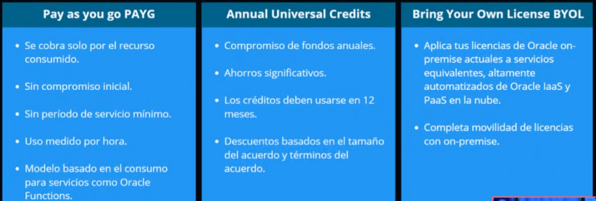
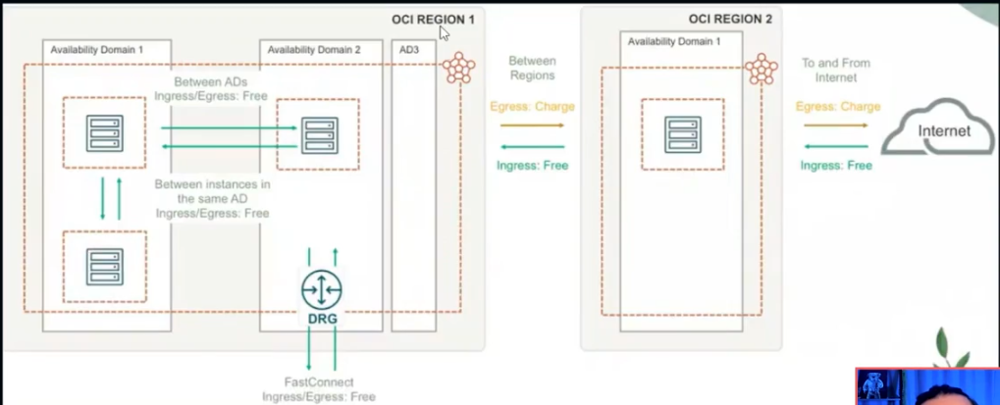
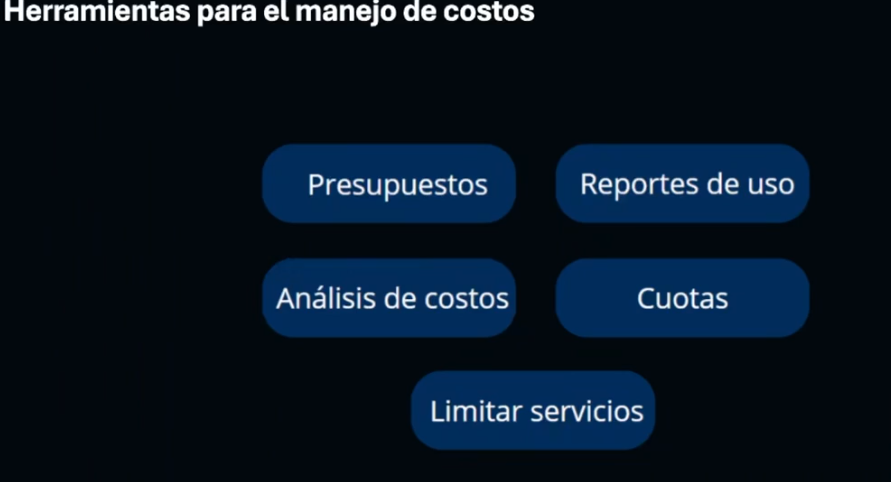
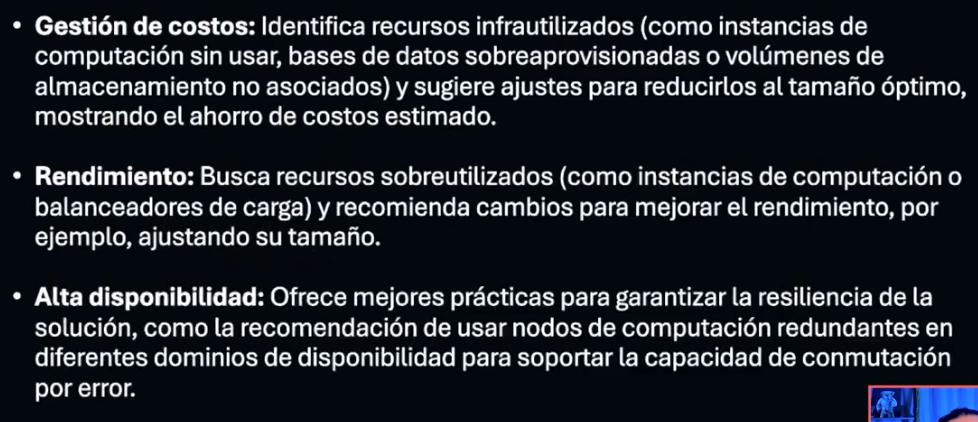
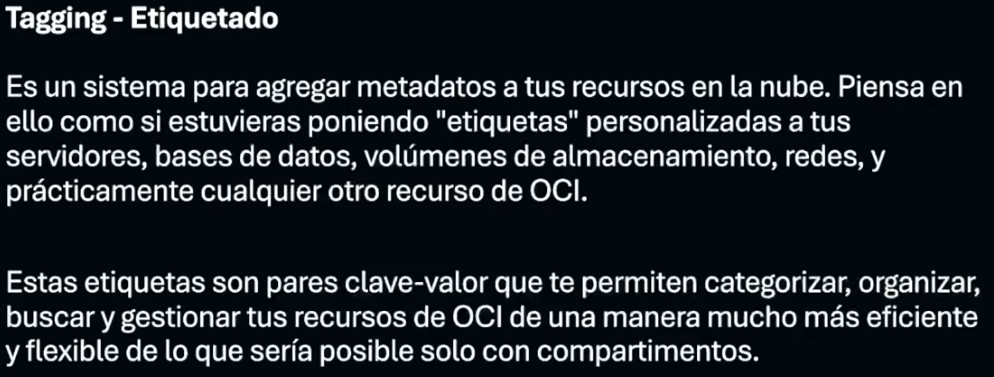
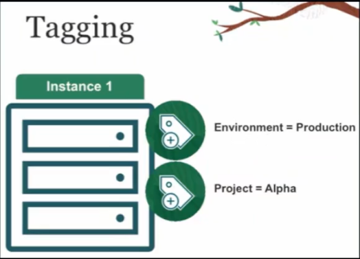
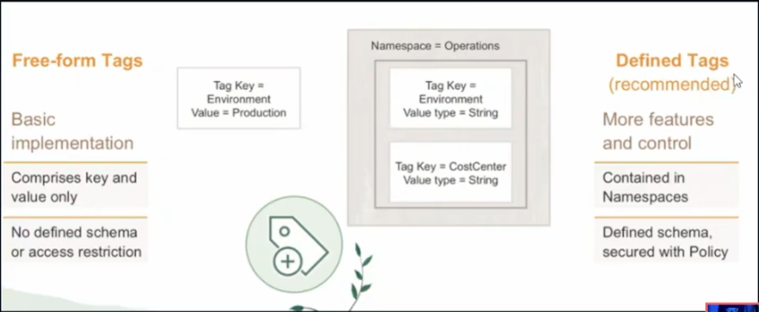

# PRECIOS

SIMPLE, TRANSPARENTE, MENOR PRECIO

PAY AS YOU GO PAYG

ANNUAL UNIVERSAL CREDIT

BRING YOUR OWN LICENSE BYOL

# FACTORES QUE IMPACTAN EL PRECIO
## TAMAÑO DE RECURSOS
MIENTRAS MAYOR SEA EL RECURSO MAYOR SERA EL COSTO

## TRANSFERENCIA DE DATOS
NO HAY COSTO POR INGRESO
TEN CUIDADO CON LOS COSTOS DE EGRESO

# TIPO DE RECURSO
VMS VS BMS
VMS VS FUNCTIONS
BYOL VS MANAGED DBS

TODAS LAS REGIONES DE OCI TIENEN EL MISMO PRECIO

# MANEJO DE COSTOS
BUDGETS

COST ANALYSIS

COST AND USAGE REPORTS

LIMITS, QUOTAS AND USAGE

# CUOTAS DE COMPARTIMIENTO

## SET:
CONFIGURA EL NUMERO MAXIMO DE RECURSO QUE UN COMPATIMIEN PUDE USAR

## UNSET.
restable las cuotas la limites por defecto

## zero:
ELIMINA EL ACCESOS RECURSO DEL COMPORTIMIENTO.

# CLOUD ADVISOR

## GESTION DE COSTOS
## RENDIMIENTOS
## ALTA DISPONIBILIDAD

# TAGGING

TAGGING-ETIQUETADO

PARA QUE SIRVE
MEJOR ORGANIZACION DE LOS RECURSOS
MANEJO DE COSTOS
TAG BASED ACCESS CONTROL

# Servicio y compartimento en OCI

En Oracle Cloud Infrastructure, ¿cuál es la principal diferencia entre los límites de servicio y las cuotas de compartimento? 
Los límites de servicio son definidos por Oracle para un arrendamiento o región, mientras que las cuotas de compartimento son definidas por el usuario para compartimentos específicos

Los límites de servicio son establecidos por Oracle y se aplican a un arrendamiento o región, mientras que las cuotas de compartimento son configuradas por los usuarios para compartimentos específicos. 

# Tipo de tráfico en OCI

¿Qué tipo de tráfico se cobra en los costos de transferencia de datos en Oracle Cloud Infrastructure?

El tráfico de salida hacia internet es cobrado.

En OCI, el tráfico de salida (datos que salen de OCI hacia internet) es cobrado después de los primeros 10 TB/mes, dependiendo de la región y el destino. El tráfico de entrada (datos que ingresan a OCI desde internet) generalmente es gratuito.

# Modelos de precios en OCI

¿Cuál NO es un modelo de precios admitido por Oracle Cloud Infrastructure? 

Suscripciones soberanas

El "Suscripciones soberanas" no es un modelo de precios disponible en OCI. 

# Precios en OCI

¿Cuál NO es un factor que influye en el precio en Oracle Cloud Infrastructure? 
Elección de la región de OCI

OCI mantiene el mismo precio en todas las regiones, por lo que la elección de la región no afecta directamente el costo. Los principales factores que influyen en el precio incluyen la transferencia de datos, los servicios consumidos y el tipo de recurso utilizado. 

#  Notificaciones de límites en OCI
En Oracle Cloud Infrastructure, ¿qué puedes configurar para recibir notificaciones cuando se alcancen los límites del presupuesto? 
Alertas por correo electrónico

En OCI, puedes configurar alertas por correo electrónico para recibir notificaciones cuando se alcancen los límites del presupuesto, lo que ayuda a los clientes a gestionar sus costos de manera efectiva. 