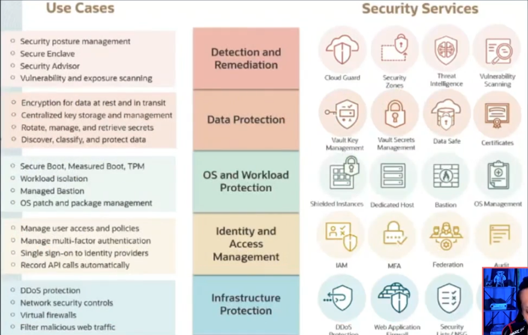

# SECURITY
## SHARE SECURITY MODEL

# USE CASES AND SECURITY SERVICES

INFRASTRUCTURE PROTECTION: DDOS PROTECTION, WEB APPLICATION FIREWALL, SECURITY LIST/NSG, NETWORK FIREWALL
IDENTITY AND ACCESS MANAGEMENT: IAM, MFA, FEDERATION, AUDIT
OS AND WORKLOAD PROTECTION: SHIELD INSTANCES, DEDICATED HOST, BASTION
DATA PROTECTION: VAULT KEY MANAGEMENT, VAULT SECRET MANAGEMENT
DETECTION AND REMEDIATION: CLOUD GUARD, SECURITY ZONES, TREAT INTELLIGENCE, VULNERABILITY SCANNING

# CREANDO SECURITY ZONE

https://docs.oracle.com/en-us/iaas/Content/security-zone/using/security-zones.htm

# CLOUD GUARD
## DETECTA PROBLEMAS:
VERIFICA LA CONFIGURACION 
MONITOREA ACTIVIDAD

## APLICA RESPUESTAS
CORRELACIONA PROBLEMAS
APLICAR SOLUCIONES

TARGETS ->  DETECTORS -> PROBLEMS -> RESPONDERS

CONCEPTO DE SEVERITY IMPORTANTE!!!

# SECURITY ZONES Y SECURITY ADVISOR

## SECURITY ADVISOR
SE REFIERE A UN SERVICO DE NUBE QUE UNIFICA ZONAS DE SEGURIDAD, CLOUD GUARD Y OTRAS CAPACIDADES DE LA NUBE

## SECURITY ZONE

SE REFIERE A UN COMPARTIMIENTO EN EL CUAL NO PUEDES DESABILITAR LA SEGURIDAD

# ENCRIPTION - CIFRADO <video controls src="Certificacion Oracle Cloud Infrastructure gestion de datos segur.mp4" title="Title"></video>

## CIFRADO
ES UTILIZADO PARA TRANSFORMAR UN TEXTO PLANO EN UN TEXTO CIFRADO

## DESCIFRADO
ES EL PROCESO DE TRANSFORMA UN TEXTO CIFRADO EN UN TEXTO PLANO.

# ENCRYPTION AT REST  --->  ENCRIPTION IN-TRANSIT

# CIFRADO SIMETRICO
CRIPTOGRAFIA SIMENTRICA ES CUANDO UTILIZAMOS UNA UNICA LLAVE PARA CIFRAR Y DESCIFRAR EL CONTENIDO

# CIFRADO ASIMETRICO
CRIPTOGRAFIA ASIMETRICA ES CUANDO UTILIZAMOS DIFERENTES LLAVES PARA CIFRAR Y DESCIFRAR EL CONTENIDO.

# AES-ADVANCED EBCRIPTION STANDAR
LA MISMA LLAVE CIFRA Y DESCIFRA LOS DATOS, NO PUEDE SE USADO PARA UNA FIRMA DIGITAL

# RSA-RIVEST SHAMIR ADLIMAN
UNA LLAVE PUBLICA CIFRA Y UNA LLAVE PRIVADA DESCIFRA LOS DATOS, PUEDE SER USADO PARA FIRMA DIGITAL.

# ECDSA-ELLIPTIC CURVE DIGITAL SIGNATURE ALGORITHM
SOLO PUEDE SER USADA PARA FIRMA DIGITAL, NO PARA CIFRAR NI DESCIFRAR DATOS.

# HARDWARE SECURITY MODULE HSM
ES UN SERVICIO QUE PROPORCIONA MODULOS DE SEGURIDAD DE HARDWARE DEDICADOS Y ALTAMENTE SEGUROS PARA ALMACENAR Y GESTIONAR CLAVES CRIPTOGRAFICAS.
PIENSALO COMO UNA CAJA FUERTE DIGITAL FORTIFICADO DENTRO DE LA NABE DE ORACLE.
"EL SERVICIO OCI VAULT UTILIZA HSM QUE CUMPLE CON LOS ESTANDARES FEDERALES DE PROCESAMIENTO DE INFORMACION (FIPS) 140-2, CERTIFICACION DE SEGURIDAD DE NIVEL 3"

# HARDWARE SECURITY MODULE HSM
RESISTE A LA MANIPULACION
REQUEIRE AUTENTICACION BASADA EN IDENTIDAD
ELIMINA LAS CLAVES DEL DISPOSITIVO CUANDO DETECTA MANIPULACION

# VAULT

MANEJO CENTRALIZADO DE LLAVES Y CREDENCIALES
LAS LLAVES(KEYS) Y SECRETS NO SON EXPUESTOS EN LE CODIGO O EN ARCHIVOS DE CONFIGURACION.

## MASTER SECURITY KEY PROTECTED BY SOFTWARE
ALMACENADO EN SERVIDOR
PUEDE SER EXPUESTO DESE EL SERVIDOR

## MASTER SECURITY KEY PROTECTED BY HSM
ALMACENADO EN UN DISPOSITIVO HSM
NO PUEDE SER EXPORTADO DEL HSM

# ENVELOPE ENCRYPTION

# Zonas de Seguridad de OCI
¿Cuál es la principal ventaja de usar las Zonas de Seguridad de OCI al implementar recursos en su entorno de nube? 

Garantizar la adhesión a las mejores prácticas y políticas de seguridad.

Las Zonas de Seguridad ayudan a mantener una postura de seguridad sólida, aplicando automáticamente políticas de seguridad predefinidas en compartimentos designados, evitando la creación de recursos no conformes. 

# Sobre Oracle Cloud Guard
¿Cuál opción NO es un componente de Oracle Cloud Guard? 
Objetivos

Oracle Cloud Guard está compuesto por detectores, problemas y respondedores. Los objetivos no son un componente de Oracle Cloud Guard. 

# Sobre OCI Vault
¿Cuál de los siguientes NO es un componente del servicio Oracle Cloud Infrastructure Vault? 

Backup de base de datos

OCI Vault incluye cofres, secretos y claves maestras de cifrado. El backup de base de datos está asociado con el servicio de base de datos de OCI, no con Vault. 

# Modelo de responsabilidad compartida
En el modelo de responsabilidad compartida de seguridad de OCI, ¿quién es responsable de proteger la infraestructura de nube subyacente?
Oracle

En el modelo de responsabilidad compartida, Oracle es responsable de proteger la infraestructura física, como centros de datos y hardware, mientras que los clientes son responsables de proteger sus datos y aplicaciones. 

# Sobre el propósito del OCI Vault
¿Cuál es el propósito principal del servicio Oracle Cloud Infrastructure Vault?
Almacenar y gestionar claves de cifrado y secretos.

El servicio OCI Vault está diseñado para almacenar y gestionar claves de cifrado y secretos de manera segura, protegiendo datos sensibles. 