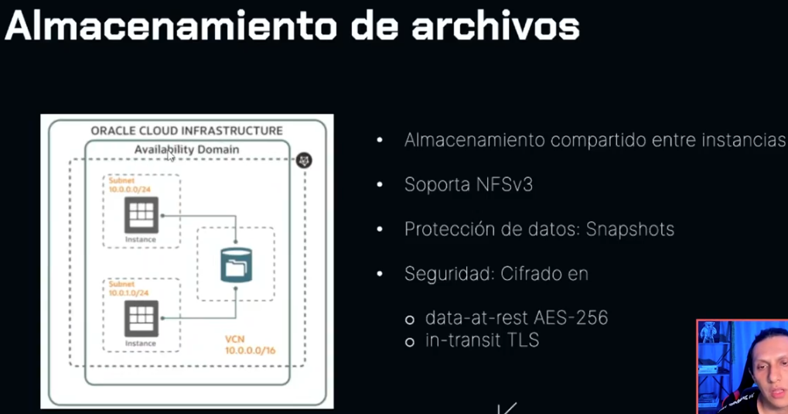
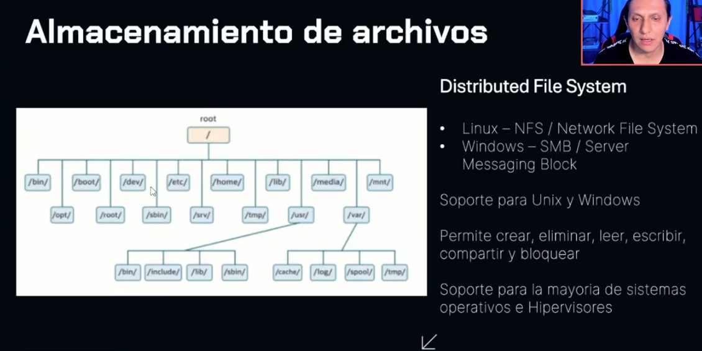
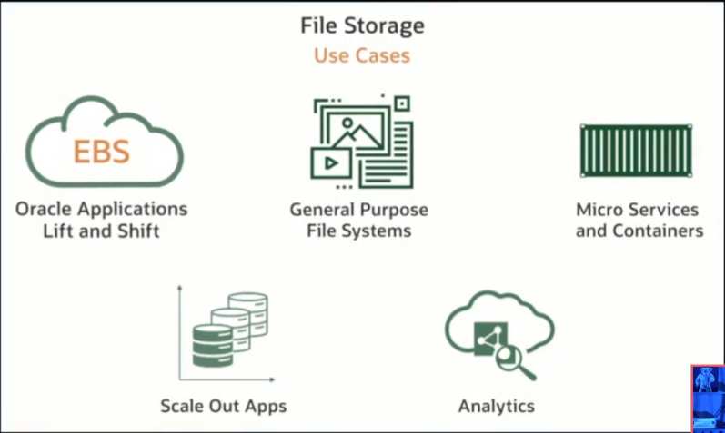

# STORAGE

ARCHIVOS
BASES DE DATOS
TEXTO
FOTOS
AUDIO
VIDEOS

# PERSITENTE VS NO PERSISTENTE

# RENDIMIENTO
IOPS - INPUT/OUTPUT OPERATIONS PER SECOND
CAPACIDAD DE PROCESAMIENTO

# PERSISTENTE
ALMACENAR LOS DATOS DE FORMA SEGURA

# DURABILIDAD
REALIZAR MUTIPLES COPIAS DE LOS DATOS, EN CASO DE ALGUN ERROR EN EL ALMACENAMIENTO, AUN SE TENGAN RESPALDOS

# CONECTIVIDAD, LOCAL STORAGE, NETWORK STORAGE, COMO ACCEDO A LOS DATOS
# PROTOCOLO, BLOCK, FILE, HTTP

# LOCAL NVME
NON-VOLATILE MEMORY EXPRESS
DOMINIO DE DISPONIBILIDAD AD
ALMACENAMIENTO CONECTADO LOCALMENTE
SSDS

# BLOCK VOLUME
DOMINIO DE DISPONIBILIDAD AD
PERSISTENTE, DURABLE, TAMÑO FIJO
SE CREA UNA PARTICION
SE CREA UN FILESYSTEM
SE CARGA UN FILESYSTEM

# FILE STORAGE
DOMINIO DE DISPONIBILIDAD AD
ARCHIVOS Y DIRECTORIOS
CARGAR FILE SYSTEM

# OBJECT STORAGE
FOTOS
VIDEOS
ARCHIVOS DE LOG
ARCHIVOS DE TEXTO
PUT-GET
POR INTERNET

# OCI DATA MIGRATION SERVICES / DATA TRANSFER DISK / DATA TRANSFER APPLIANCE

DTD = TU TOMAS LOS DISCOS Y ELLOS SE ENCARGAN DE TOMAR LA INFORMACION Y CARGARLAS A LA CUENTA
DTA = ELLOS TE ENVIAN UN DISPOSITVO PARA LAMACENAR LOS DATOS Y LUEGO ELLOS LA VINCULAN CON LA CUENTA

# OBJECT STORAGE

ALMACENAMIENTO DE ALTO DESEMPEÑO
DATOS SON ALMACENADOS COMO OBJETOS
IDEAL PARA DATOS SIN ESTRUCTURA 'UNSTRUCTURED'

(KEY VALUE) IMPORTANTE!

# ESCENARIOS

ALAMCENAR CONTENIDO
UNSTRUCTURE Y SEMI-STRUCTURED DATA
BIG DATA/ SPARK / HADOOP / DATA ANALYTICS
ARCHIVE / BACKUP

# OBJECT STORAGE RESOURCES
OBJETO- METADATA
BUCKET - NOMBRE UNICO EN EL TENANCY JERARQUIA PLANA
NAMESPACE - CONTENEDOR LOGICO PARA BUCKETS Y OBJETOS DENTRO DE OBJET STORAGE

# STANDART ACCESS STORAGE TIER
RAPIDO, INMEDIATO, ACCESO FEECUENTE
COPIA MAS RECIENTE DE LA INFO
RECUPERACION INSTANTANEA

HOT - CALIENTE IMPORTANTE!

# INFREQUENT ACCESS STORAGE TIER
IDEAL PARA DATOS QUE SON REQUERIDOS POCO FECUENTE
TIEMPO MINIMO DE RETENCION 31 DIAS
($)CUOTAS DE RECUPERACION

(COOL - NORMAL) IMPORTANTE

# ARCHIVE STORAGE TIER
DATOS RARA VEZ ACCEDIDOS
RETENCION MINIMA REQUERIDA 90 DIAS
LOS OBJETOS NECESITAN SER RESTAURADOS ANTES DE SER DESCARGADOS

TIEMPO DE RESTAURACION: 1 HORA
TIEMPO DE DESCARGA: 24 HORAS
(COLD - FRIO)

# AUTO TIERING

# DATA ENCRYPTION

LOS DATOS SON COFRADOS POR DEFECTO Y PUEDES UTILIZAR TU PROPIA LLAVE DE CIFRADO

(RECORDAR TENEMOS NUESTRO BUCKED LUEGO NUESTROS OBJETOS Y VAMOS A PODER LLEGAR A ELLOS POR MEDIO DE UNA URL)

# OCI OBJECT STORAGE

# BLOCK VOLUME

CREAR Y VINCULAR (ATTACH) ALMACENAMIENTO
DESVICULAR (DETTACH) Y ELIMINAR ALMACENAMIENTO
PERSISTRI LOS DATOS ICLUSO DESPUES DE QUE SE ELIMINE LA INFORMACION

# IMPORTANTE!
## BLOCK VOLUME TIERS
BAJO COSTO - LOWER COST
GRANDES CARGAS DE TRABAJO SECUENCIALES / 2 IOPS/GB

BALANCEADO - BALANCED
EQUILIBRIO ENTRE RENDIMIENTO Y AHORRO DE PARA LA MAYORIA DE LAS CARGAS DE TRABAJO / 60 IOPS/GB

ALTO RENDIMIENTO - HIGHER PERFORMANCE
CARGAS DE TRABAJO QUE REQUIEREN ALTO PROCESAMIENTO / 75 IOPS/GB

ULTRA ALTO RENDIMIENTO - ULTRA HIGH
PARA CARAGS DE TRABAJO CON LOS MAYORES REQUISITOS DE I/O / 90/225 IOPS/GB

# ENCRYPTED BLOCK VOLUMES
BRING YOUR OWN KEYS
IN-TRANSIT ENCRYPTION

# BLOCK VOLUME
(MULTIPLES VMS PUEDEN ESCRIBIR Y LEER DATOS A UN UNICO BLOCK VOLUME)

# REPLICACION DE BLOCK VOLUMES 
REPLICA A TRAVES DE REGIONES
RECUPERACION ANTE DESASTRES
MIGRACIONES
EXPANSION DE NEGOCIO

REPLICACION ASINCRONA

# VOLUME GROUPS
AGRUPCION DE VOLUMENES PARA UN MANEJO MAS FACIL
COPIAS DE SEGURIDAD DE MULTIPLES VOLUMENES
ENTRE MULTIPLES INSTANCIAS

# RENDIMENSIONAMIENTO BLOCK VOLUMES
ONLINE
OFFLINE

# FILE STORAGE

COLECCION JERARQUICA DE DOCUMENTOS ORGANIZADOS EN CARPETAS

PERMITE QUE VARIAS INSTANCIAS DE COMPUTO(EJECUTEN LINUX, WINDOWS, ETC.)
MONTEN EL MISMO SISTEMA DE ARCHIVOS Y ACCEDAN A LOS MISMOS DATOS AL MISMO TIEMPO.
ESTO ES IDEAL PARA APLICACIONES DE NECESITAN COMPARTIR ARCHIVOS, COMO SERVIDORES WEB, REPOSITORIOS DE CODIGO, HERRAMIENTAS DE COLABORACION, Y APLICACIONES PERSONALIZADAS.

# ALMACENAMIENTO DE ARCHIVOS

ALMACENAMIENTO COMPRTIDO ENTRE INSTANCIAS
SOPORTA NFSV3
PROTECCION DE DATOS: SNAPSHOTS
SEGURIDAD: CIFRADO EN DATA-AT-REST AES-256 / IN-TRANSIT TLS

## DISTRIBUTED FILE SYSTEM
LIUX - NFS / NETWORK FILE SYSTEM
WINDOWS - SMB / SERVER MESSAGING BLOCK

SOPORTE PARA UIX Y WINDOWS

PERMITE CREAR, ELIMINAR, LEER, ESCRIBIR, COMPARTIR Y BLOQUEAR.

SOPORTE PARA LA MAYORIA DE SISTEMAS OPERATIVOS E HIPERVISORES

# Nivel de almacenamiento archive
Has creado un bucket de Almacenamiento de Objetos en el nivel Archive. ¿Cuál afirmación NO es válida para el nivel de almacenamiento Archive?

El bucket de almacenamiento Archive puede actualizarse al almacenamiento Standard.

Un bucket de almacenamiento Archive no puede actualizarse al nivel Standard. Además, la duración mínima para almacenar objetos en el nivel Archive es de 90 días, y los objetos no pueden accederse directamente; deben restaurarse al nivel Standard antes de poder leerse. 

# Recursos de OCI Block Volume

¿Qué recurso del servicio Oracle Cloud Infrastructure Block Volume garantiza la durabilidad de los datos y la protección contra fallos de hardware? 
Replicación

El servicio OCI Block Volume utiliza replicación para garantizar la durabilidad de los datos y la protección contra fallos de hardware. Los datos se replican automáticamente en varios dispositivos de almacenamiento dentro del mismo dominio de disponibilidad. 

#  Rendimiento del OCI Block Volume

Tienes una carga de trabajo de base de datos de alto rendimiento que requiere al menos 90 IOPS/GB y 90,000 IOPS por volumen. ¿Qué nivel de rendimiento del OCI Block Volume puede usarse para cumplir con este requisito? 

Ultra alto rendimiento

El nivel Ultra High Performance en el servicio OCI Block Volume puede proporcionar hasta 225 IOPS/GB, con un máximo de 300.000 IOPS por volumen, siendo recomendado para cargas de trabajo con los mayores requisitos de I/O. 

# Sobre OCI Object Storage Service
En el Oracle Cloud Infrastructure Object Storage Service, ¿cuál es el propósito principal de una URL de solicitud preautenticada? 
Proporcionar acceso temporal y seguro a un objeto específico.

Una URL de solicitud preautenticada en OCI Object Storage permite generar una URL única con un tiempo de expiración predefinido, proporcionando acceso temporal y seguro a un objeto específico sin necesidad de autenticación adicional.

# Menor costo de almacenamiento
Deseas almacenar el backup de una base de datos en almacenamiento en la nube por un período prolongado con el menor costo de almacenamiento. ¿Qué nivel de almacenamiento de objetos usarías para almacenar estos archivos de backup?

    Archive

El nivel Archive está diseñado para almacenar datos raramente accedidos y que requieren largos períodos de retención, siendo ideal para respaldos de bases de datos que necesitan almacenarse por mucho tiempo a un costo reducido. 