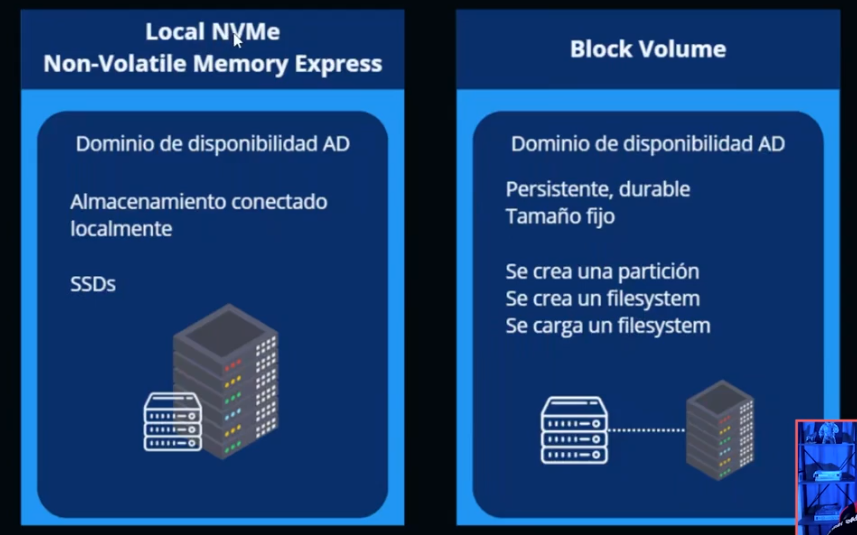
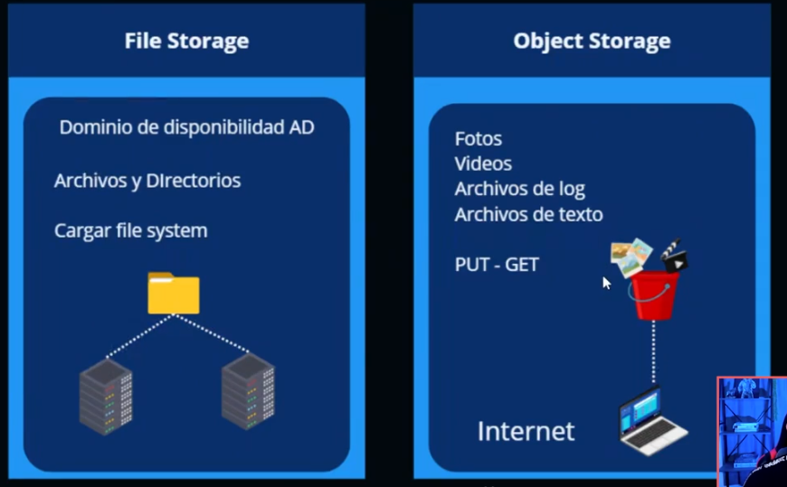
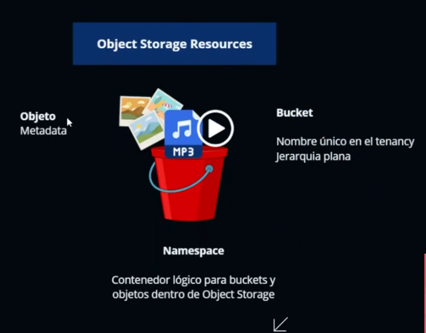
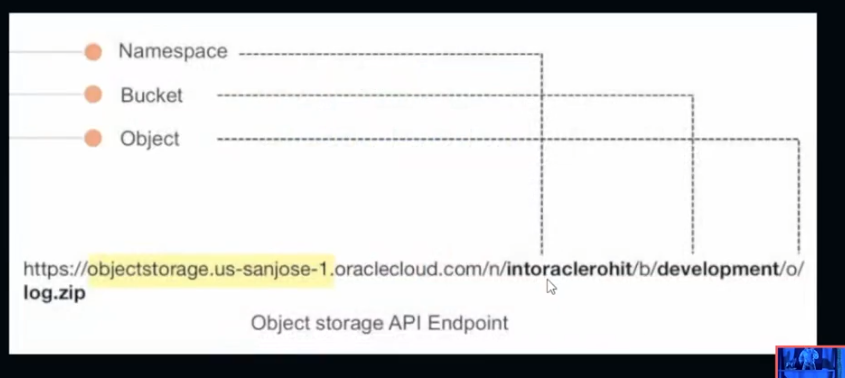
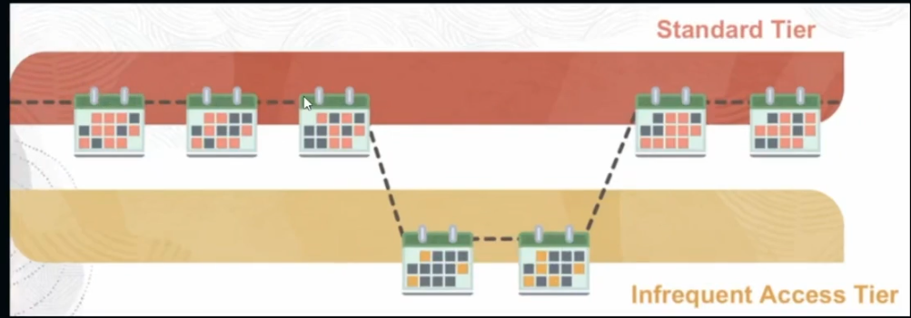

# STORAGE

ARCHIVOS
BASES DE DATOS
TEXTO
FOTOS
AUDIO
VIDEOS

# PERSITENTE VS NO PERSISTENTE

# RENDIMIENTO
IOPS - INPUT/OUTPUT OPERATIONS PER SECOND
CAPACIDAD DE PROCESAMIENTO

# PERSISTENTE
ALMACENAR LOS DATOS DE FORMA SEGURA

# DURABILIDAD
REALIZAR MUTIPLES COPIAS DE LOS DATOS, EN CASO DE ALGUN ERROR EN EL ALMACENAMIENTO, AUN SE TENGAN RESPALDOS

# CONECTIVIDAD, LOCAL STORAGE, NETWORK STORAGE, COMO ACCEDO A LOS DATOS
# PROTOCOLO, BLOCK, FILE, HTTP

# LOCAL NVME
NON-VOLATILE MEMORY EXPRESS
DOMINIO DE DISPONIBILIDAD AD
ALMACENAMIENTO CONECTADO LOCALMENTE
SSDS

# BLOCK VOLUME
DOMINIO DE DISPONIBILIDAD AD
PERSISTENTE, DURABLE, TAMÑO FIJO
SE CREA UNA PARTICION
SE CREA UN FILESYSTEM
SE CARGA UN FILESYSTEM

# FILE STORAGE
DOMINIO DE DISPONIBILIDAD AD
ARCHIVOS Y DIRECTORIOS
CARGAR FILE SYSTEM

# OBJECT STORAGE
FOTOS
VIDEOS
ARCHIVOS DE LOG
ARCHIVOS DE TEXTO
PUT-GET
POR INTERNET

# OCI DATA MIGRATION SERVICES / DATA TRANSFER DISK / DATA TRANSFER APPLIANCE

DTD = TU TOMAS LOS DISCOS Y ELLOS SE ENCARGAN DE TOMAR LA INFORMACION Y CARGARLAS A LA CUENTA
DTA = ELLOS TE ENVIAN UN DISPOSITVO PARA LAMACENAR LOS DATOS Y LUEGO ELLOS LA VINCULAN CON LA CUENTA

# OBJECT STORAGE

ALMACENAMIENTO DE ALTO DESEMPEÑO
DATOS SON ALMACENADOS COMO OBJETOS
IDEAL PARA DATOS SIN ESTRUCTURA 'UNSTRUCTURED'

(KEY VALUE) IMPORTANTE!

# ESCENARIOS

ALAMCENAR CONTENIDO
UNSTRUCTURE Y SEMI-STRUCTURED DATA
BIG DATA/ SPARK / HADOOP / DATA ANALYTICS
ARCHIVE / BACKUP

# OBJECT STORAGE RESOURCES
OBJETO- METADATA
BUCKET - NOMBRE UNICO EN EL TENANCY JERARQUIA PLANA
NAMESPACE - CONTENEDOR LOGICO PARA BUCKETS Y OBJETOS DENTRO DE OBJET STORAGE

# STANDART ACCESS STORAGE TIER
RAPIDO, INMEDIATO, ACCESO FEECUENTE
COPIA MAS RECIENTE DE LA INFO
RECUPERACION INSTANTANEA

HOT - CALIENTE IMPORTANTE!

# INFREQUENT ACCESS STORAGE TIER
IDEAL PARA DATOS QUE SON REQUERIDOS POCO FECUENTE
TIEMPO MINIMO DE RETENCION 31 DIAS
($)CUOTAS DE RECUPERACION

(COOL - NORMAL) IMPORTANTE

# ARCHIVE STORAGE TIER
DATOS RARA VEZ ACCEDIDOS
RETENCION MINIMA REQUERIDA 90 DIAS
LOS OBJETOS NECESITAN SER RESTAURADOS ANTES DE SER DESCARGADOS

TIEMPO DE RESTAURACION: 1 HORA
TIEMPO DE DESCARGA: 24 HORAS
(COLD - FRIO)

# AUTO TIERING

# DATA ENCRYPTION

LOS DATOS SON COFRADOS POR DEFECTO Y PUEDES UTILIZAR TU PROPIA LLAVE DE CIFRADO

(RECORDAR TENEMOS NUESTRO BUCKED LUEGO NUESTROS OBJETOS Y VAMOS A PODER LLEGAR A ELLOS POR MEDIO DE UNA URL)

# OCI OBJECT STORAGE

# BLOCK VOLUME

CREAR Y VINCULAR (ATTACH) ALMACENAMIENTO
DESVICULAR (DETTACH) Y ELIMINAR ALMACENAMIENTO
PERSISTRI LOS DATOS ICLUSO DESPUES DE QUE SE ELIMINE LA INFORMACION

# IMPORTANTE!
## BLOCK VOLUME TIERS
BAJO COSTO - LOWER COST
GRANDES CARGAS DE TRABAJO SECUENCIALES / 2 IOPS/GB

BALANCEADO - BALANCED
EQUILIBRIO ENTRE RENDIMIENTO Y AHORRO DE PARA LA MAYORIA DE LAS CARGAS DE TRABAJO / 60 IOPS/GB

ALTO RENDIMIENTO - HIGHER PERFORMANCE
CARGAS DE TRABAJO QUE REQUIEREN ALTO PROCESAMIENTO / 75 IOPS/GB

ULTRA ALTO RENDIMIENTO - ULTRA HIGH
PARA CARAGS DE TRABAJO CON LOS MAYORES REQUISITOS DE I/O / 90/225 IOPS/GB

